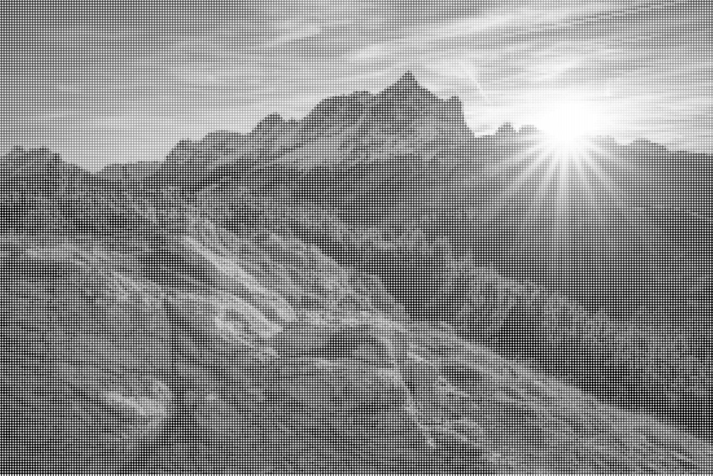

# 🎨 Dotizer

**Dotizer** is a simple Python script that transforms an image into a **dotted grayscale** version using circular tiles.

---

## 🖼️ Example

### Input  


### Output  


---

## 📦 Requirements

- Python **3.11+**
- [Poetry](https://python-poetry.org/) for managing dependencies

---

## 🔧 Installation and Usage

```bash
git clone https://github.com/Refffy/dotizer.git
cd dotizer
poetry install
poetry env activate
poetry run python dotizer.py -h
